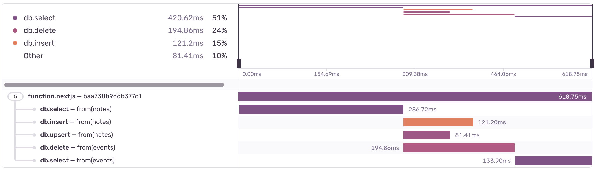
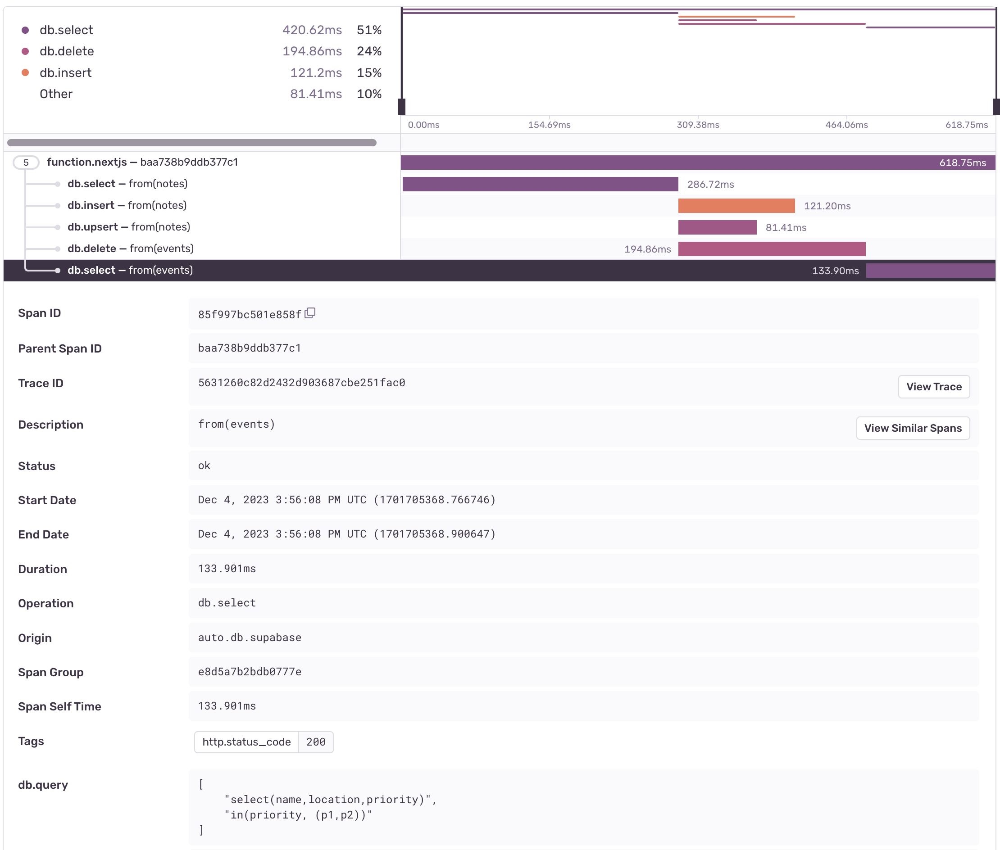
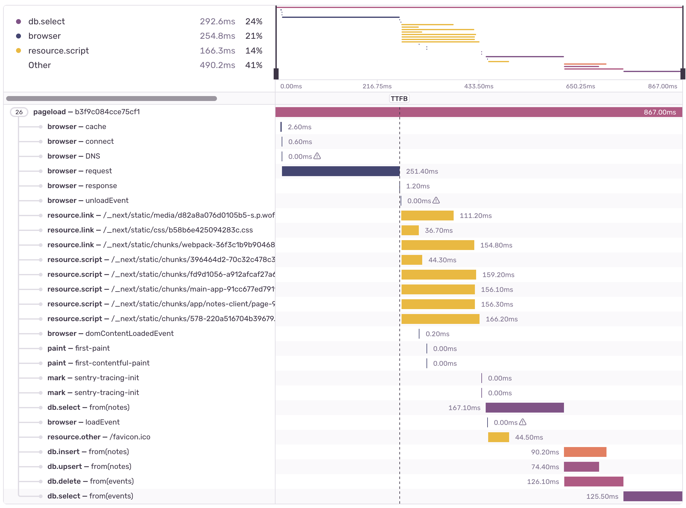
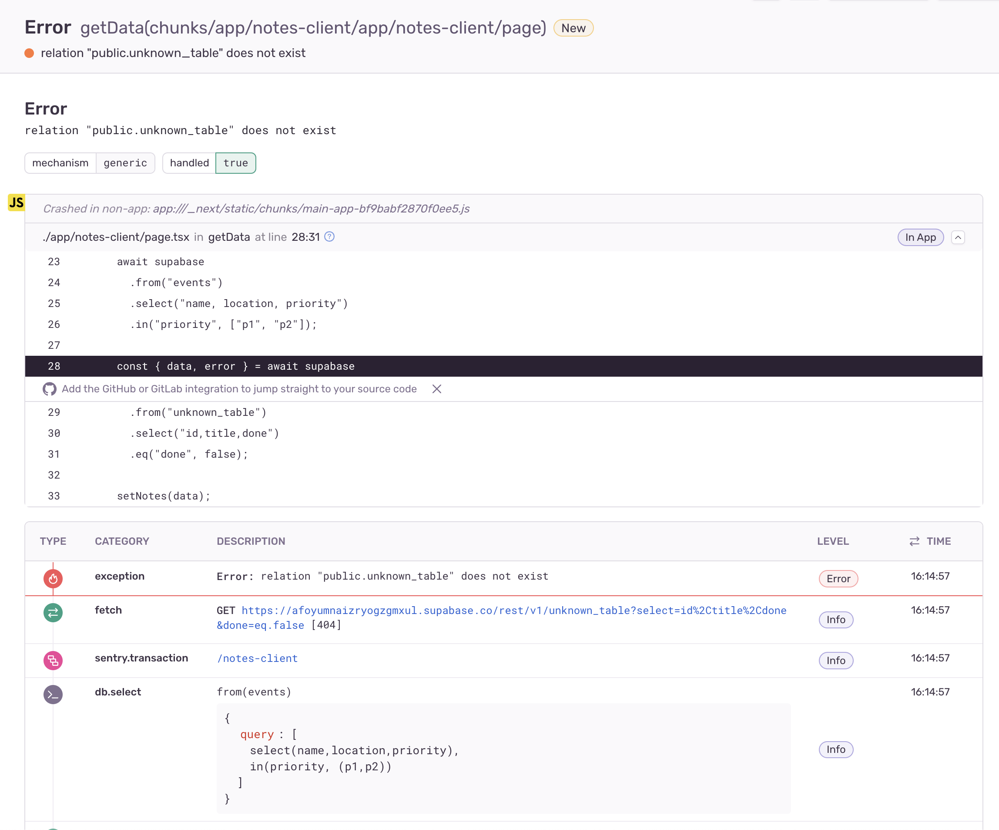
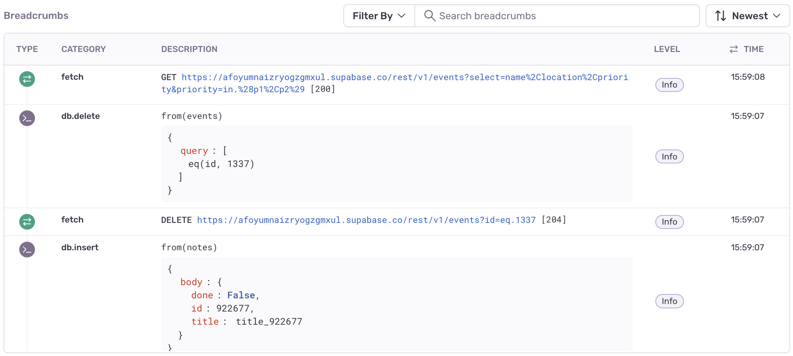

<br/>

<p align="center">
  <picture>
    <source media="(prefers-color-scheme: dark)" srcset="logos/supabase-wordmark--dark.svg" />
    <source media="(prefers-color-scheme: light)" srcset="logos/supabase-wordmark--light.svg" />
    
  </picture>
  <br />
  <picture>
    <source media="(prefers-color-scheme: dark)" srcset="logos/sentry-wordmark--dark.svg" />
    <source media="(prefers-color-scheme: light)" srcset="logos/sentry-wordmark--light.svg" />
    
  </picture>
</p>

# @supabase/sentry-js-integration

Sentry JavaScript SDK Integration that can be used to instrument Supabase JavaScript SDK and collect traces, breadcrumbs and errors. The integration supports browser, Node, and edge environments.

See [Showcase](#showcase) section for detailed screenshots of what is captured.

> [!IMPORTANT]
> If you are using Sentry JavaScript SDK v7, reference [README-v7.md](README-v7.md) instead.

## Install

```sh
npm install @supabase/sentry-js-integration
```

## Usage

```js
import * as Sentry from "@sentry/browser";
import { SupabaseClient } from "@supabase/supabase-js";
import { supabaseIntegration } from "@supabase/sentry-js-integration";

Sentry.init({
  dsn: SENTRY_DSN,
  integrations: [
    supabaseIntegration(SupabaseClient, Sentry, {
      tracing: true,
      breadcrumbs: true,
      errors: true,
    }),
  ],
});
```

or

```js
import * as Sentry from "@sentry/browser";
import { createClient } from "@supabase/supabase-js";
import { supabaseIntegration } from "@supabase/sentry-js-integration";

const supabaseClient = createClient(SUPABASE_URL, SUPABASE_KEY);

Sentry.init({
  dsn: SENTRY_DSN,
  integrations: [
    supabaseIntegration(supabaseClient, Sentry, {
      tracing: true,
      breadcrumbs: true,
      errors: true,
    }),
  ],
});
```

## Options

| Option                   | Description                                                                                                                                         | Default   |
| ------------------------ | --------------------------------------------------------------------------------------------------------------------------------------------------- | --------- |
| `tracing`                | Enable tracing instrumentation for database calls                                                                                                   | **true**  |
| `breadcrumbs`            | Enable capturing breadcrumbs for database calls                                                                                                     | **true**  |
| `errors`                 | Enable capturing non-throwable database errors as Sentry exceptions                                                                                 | **false** |
| `operations`             | Configures which methods should be instrumented for the features above                                                                              | -         |
| `sanitizeBody`           | Allows for modifying captured body values that are passed to insert, upsert, and update operations, before assigned to a span, breadcrumb, or error | -         |
| `shouldCreateSpan`       | Decide whether a span should be created based on the query payload used to capture this data                                                        | -         |
| `shouldCreateBreadcrumb` | Decide whether a breadcrumb should be created based on the query payload used to capture this data                                                  | -         |

See https://github.com/supabase-community/sentry-integration-js/blob/master/index.d.ts for detailed options types.

### Removing duplicated http/fetch spans

If you are using built-in `Http`, `Fetch` or `nativeNodeFetchIntegration` integrations in your current Sentry setup, you might want to skip some of the spans that will be already covered by `supabaseIntegration`. Here's a quick snippet how to do that:

```js
import * as Sentry from "@sentry/browser";
import { SupabaseClient } from "@supabase/supabase-js";
import { supabaseIntegration } from "@supabase/sentry-js-integration";

Sentry.init({
  dsn: SENTRY_DSN,
  integrations: [
    supabaseIntegration(SupabaseClient, Sentry, {
      tracing: true,
      breadcrumbs: true,
      errors: true,
    }),

    // @sentry/browser
    Sentry.browserTracingIntegration({
      shouldCreateSpanForRequest: (url) => {
        return !url.startsWith(`${SUPABASE_URL}/rest`);
      },
    }),

    // or @sentry/node
    Sentry.httpIntegration({
      tracing: {
        ignoreOutgoingRequests: (url) => {
          return url.startsWith(`${SUPABASE_URL}/rest`);
        },
      },
    }),

    // or @sentry/node with Fetch support
    Sentry.nativeNodeFetchIntegration({
      ignoreOutgoingRequests: (url) => {
        return url.startsWith(`${SUPABASE_URL}/rest`);
      },
    }),

    // or @sentry/WinterCGFetch for Next.js Middleware & Edge Functions
    Sentry.winterCGFetchIntegration({
      breadcrumbs: true,
      shouldCreateSpanForRequest: (url) => {
        return !url.startsWith(`${SUPABASE_URL}/rest`);
      },
    }),
  ],
});
```

<details>
  <summary>
    <h2>Example Next.js configuration</h2>
  </summary>

See this example for a setup with Next.js to cover browser, server, and edge environments. First, run through the [Sentry Next.js wizard](https://docs.sentry.io/platforms/javascript/guides/nextjs/#install) to generate the base Next.js configuration. Then add the Supabase Sentry Integration to all your `Sentry.init` calls with the appropriate filters.

`sentry.client.config.ts`

```js sentry.client.config.ts
import * as Sentry from "@sentry/nextjs";
import { SupabaseClient } from "@supabase/supabase-js";
import { supabaseIntegration } from "@supabase/sentry-js-integration";

Sentry.init({
  dsn: SENTRY_DSN,
  // Adjust this value in production, or use tracesSampler for greater control
  tracesSampleRate: 1,

  // Setting this option to true will print useful information to the console while you're setting up Sentry.
  debug: true,

  replaysOnErrorSampleRate: 1.0,

  // This sets the sample rate to be 10%. You may want this to be 100% while
  // in development and sample at a lower rate in production
  replaysSessionSampleRate: 0.1,

  // You can remove this option if you're not planning to use the Sentry Session Replay feature:
  integrations: [
    Sentry.replayIntegration({
      // Additional Replay configuration goes in here, for example:
      maskAllText: true,
      blockAllMedia: true,
    }),
    supabaseIntegration(SupabaseClient, Sentry, {
      tracing: true,
      breadcrumbs: true,
      errors: true,
    }),
    Sentry.browserTracingIntegration({
      shouldCreateSpanForRequest: (url) => {
        return !url.startsWith(`${process.env.NEXT_PUBLIC_SUPABASE_URL}/rest`);
      },
    }),
  ],
});
```

`sentry.server.config.ts`

```js sentry.server.config.ts
import * as Sentry from "@sentry/nextjs";
import { SupabaseClient } from "@supabase/supabase-js";
import { supabaseIntegration } from "@supabase/sentry-js-integration";

Sentry.init({
  dsn: SENTRY_DSN,
  integrations: [
    supabaseIntegration(SupabaseClient, Sentry, {
      tracing: true,
      breadcrumbs: true,
      errors: true,
    }),
    Sentry.nativeNodeFetchIntegration({
      ignoreOutgoingRequests: (url) => {
        console.log(
          "server",
          `${process.env.NEXT_PUBLIC_SUPABASE_URL}/rest`,
          url
        );
        return url.startsWith(`${process.env.NEXT_PUBLIC_SUPABASE_URL}/rest`);
      },
    }),
  ],

  // Adjust this value in production, or use tracesSampler for greater control
  tracesSampleRate: 1,

  // Setting this option to true will print useful information to the console while you're setting up Sentry.
  debug: true,
});
```

`sentry.edge.config.ts`

```js sentry.edge.config.ts
import * as Sentry from "@sentry/nextjs";
import { SupabaseClient } from "@supabase/supabase-js";
import { supabaseIntegration } from "@supabase/sentry-js-integration";

Sentry.init({
  dsn: SENTRY_DSN,
  integrations: [
    supabaseIntegration(SupabaseClient, Sentry, {
      tracing: true,
      breadcrumbs: true,
      errors: true,
    }),
    Sentry.winterCGFetchIntegration({
      breadcrumbs: true,
      shouldCreateSpanForRequest: (url) => {
        return !url.startsWith(`${process.env.NEXT_PUBLIC_SUPABASE_URL}/rest`);
      },
    }),
  ],
  // Adjust this value in production, or use tracesSampler for greater control
  tracesSampleRate: 1,

  // Setting this option to true will print useful information to the console while you're setting up Sentry.
  debug: true,
});
```

```js instrumentation.ts
export async function register() {
  if (process.env.NEXT_RUNTIME === "nodejs") {
    await import("./sentry.server.config");
  }

  if (process.env.NEXT_RUNTIME === "edge") {
    await import("./sentry.edge.config");
  }
}
```

Afterward build your application (`npm run build`) and start it locally (`npm run start`). You will now see the transactions being logged in the terminal when making supabase-js requests.

</details>

## Developing

Run library unit tests:

```sh
npm install
npm run lint
npm run test
```

Run types tests for SDK v8:

```sh
cd tests-types/v8
npm install
npm run test
```

Run types tests for SDK v7:

```sh
cd tests-types/v7
npm install
npm run test
```

## Publishing

```sh
# Add new files to package.json#files if applicable
npm version <patch|minor|major>
git push --follow-tags
npm publish
```

Then bump release version + changelog in [https://github.com/supabase-community/sentry-integration-js/releases](https://github.com/supabase-community/sentry-integration-js/releases).

## Showcase

_(click to enlarge image)_

### Server-side Traces

<table>
  <tr>
    <td valign="top"></td>
    <td valign="top"></td>
  </tr>
</table>

### Client-side Traces

<table>
  <tr>
    <td valign="top"></td>
    <td valign="top"></td>
  </tr>
</table>

### Capturing Non-throwable Errors

<table>
  <tr>
    <td valign="top"></td>
  </tr>
</table>

### Breadcrumbs

<table>
  <tr>
    <td valign="top"></td>
  </tr>
</table>

### Payload Sanitization

<table>
  <tr>
    <td valign="top"></td>
  </tr>
</table>
